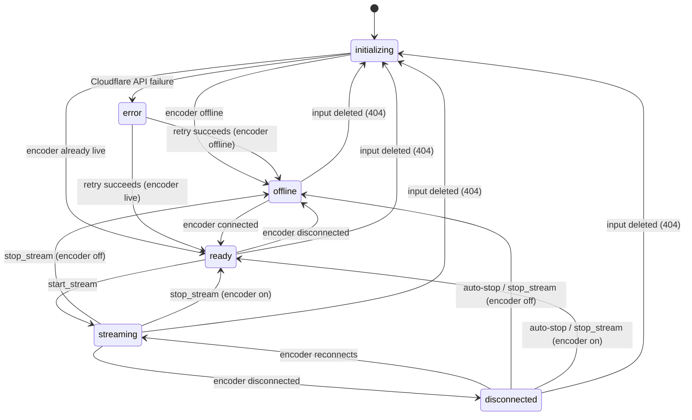

# Livestream Architecture

## Overview

Streampai's livestream system manages multi-platform streaming (Twitch, YouTube, Facebook, Kick) through Cloudflare's Live Input/Output infrastructure. A single `gen_statem` state machine per user orchestrates the entire lifecycle — from Cloudflare input initialization through streaming to cleanup.

## Process Tree

```
UserSupervisor (DynamicSupervisor, one_for_one)
└── StreamManager (gen_statem, per user)
    └── StreamServices (DynamicSupervisor, per user)
        ├── AlertQueue
        ├── TwitchManager
        ├── YouTubeManager
        ├── FacebookManager
        └── KickManager
```

- **UserSupervisor** — top-level `DynamicSupervisor`. Starts a `StreamManager` per user on demand via `get_user_stream/1`.
- **StreamManager** — `gen_statem` state machine. Single source of truth for stream state. Spawns `StreamServices` during init.
- **StreamServices** — `DynamicSupervisor` hosting platform managers and the alert queue. Initializes connected platform managers automatically on startup.

## State Machine

StreamManager uses `:gen_statem` with `[:handle_event_function, :state_enter]` callback modes.

### States



| State           | Meaning                                         | Encoder      | Streaming      |
| --------------- | ----------------------------------------------- | ------------ | -------------- |
| `:initializing` | Setting up Cloudflare live inputs               | Unknown      | No             |
| `:offline`      | Inputs ready, encoder not connected             | Disconnected | No             |
| `:ready`        | Encoder connected, can start stream             | Connected    | No             |
| `:streaming`    | Live on platforms                               | Connected    | Yes            |
| `:disconnected` | Encoder dropped mid-stream, 10s auto-stop timer | Disconnected | Yes (draining) |
| `:stopping`     | Cleanup in progress                             | Any          | Ending         |
| `:error`        | Initialization failed, retries in 30s           | Unknown      | No             |

### Transitions

| From             | To                | Trigger                                             |
| ---------------- | ----------------- | --------------------------------------------------- |
| `initializing`   | `offline`         | Inputs ready, encoder offline                       |
| `initializing`   | `ready`           | Inputs ready, encoder already live                  |
| `initializing`   | `error`           | Cloudflare API failure                              |
| `error`          | `offline`/`ready` | Retry succeeds (30s timer)                          |
| `offline`        | `ready`           | Poll/webhook detects encoder connected              |
| `ready`          | `offline`         | Poll/webhook detects encoder disconnected           |
| `ready`          | `streaming`       | `start_stream` call succeeds                        |
| `streaming`      | `disconnected`    | Poll/webhook detects encoder disconnected           |
| `streaming`      | `offline`/`ready` | `stop_stream` call                                  |
| `disconnected`   | `streaming`       | Encoder reconnects within 10s                       |
| `disconnected`   | `offline`/`ready` | Auto-stop after 10s timeout or manual `stop_stream` |
| Any active state | `initializing`    | Cloudflare input deleted (404 on poll)              |

Every state transition is logged via the `:enter` callback.

### State Data

```elixir
%StreamManager{
  user_id: String.t(),
  livestream_id: String.t() | nil,
  started_at: DateTime.t() | nil,
  statistics: map(),
  platforms: map(),
  account_id: String.t(),          # Cloudflare account
  api_token: String.t(),           # Cloudflare token
  horizontal_input: map() | nil,   # Primary Cloudflare live input
  vertical_input: map() | nil,     # Secondary Cloudflare live input
  live_outputs: map(),             # Platform RTMP outputs
  last_streaming_at: DateTime.t() | nil,
  poll_timer: reference() | nil,
  poll_interval: integer(),
  services_pid: pid()              # StreamServices supervisor
}
```

## Initialization Flow

1. `init/1` loads Cloudflare config, creates empty state struct, starts `StreamServices`
2. Dispatches `{:next_event, :internal, :initialize}`
3. `:initialize` handler:
   - Loads `StreamManagerState` from DB (restores `livestream_id` if stream was active)
   - Calls `InputManager.get_live_inputs/1` — fetches or creates horizontal + vertical Cloudflare inputs
   - Starts input status polling
   - Calls `InputManager.check_streaming_status/1` to determine initial state
   - If encoder is already live → transitions to `:ready` (writes `live_input_uid` + `input_streaming: true`)
   - If encoder is offline → transitions to `:offline` (writes `live_input_uid`)
   - On failure → transitions to `:error`, schedules `:retry_initialize` in 30s

## Cloudflare Integration

### InputManager

Manages live inputs (RTMP/SRT/WebRTC ingest points).

- **`get_live_inputs/1`** — gets or creates both horizontal and vertical inputs via `LiveInput.get_or_fetch_for_user_with_test_mode`
- **`check_streaming_status/1`** — polls Cloudflare API for both inputs. Returns `:live` if either is connected, `:offline` if both are idle, `{:error, :input_deleted}` on 404
- **`handle_deletion/1`** — clears input state, deletes stale DB records, triggers re-initialization

### OutputManager

Manages live outputs (RTMP forwarding to platforms).

- **`enable/1`** / **`disable/1`** — toggles all outputs on/off via Cloudflare API
- **`cleanup_all/1`** — fetches and deletes all outputs for the input
- **`update/2`** — creates outputs for a set of platform configs
- **`delete/3`** — removes a single platform output

Platform RTMP endpoints:

- Twitch: `rtmp://live.twitch.tv/app`
- YouTube: `rtmp://a.rtmp.youtube.com/live2`
- Facebook: `rtmps://live-api-s.facebook.com:443/rtmp`
- Kick: `rtmp://ingest.kick.com/live`

### Input Status Polling

Polls Cloudflare every 5s (configurable via `:cloudflare_input_poll_interval`). Polling runs in `:offline`, `:ready`, `:streaming`, and `:disconnected` states. Ignored during `:initializing` and `:error`.

Status changes trigger state transitions via `apply_input_status_change/3`:

- `:live` detected in `:offline` → move to `:ready`
- `:offline` detected in `:ready` → move to `:offline`
- `:offline` detected in `:streaming` → move to `:disconnected` (starts 10s auto-stop timer)
- `:live` detected in `:disconnected` → move back to `:streaming`
- `:input_deleted` → re-initialize inputs

Cloudflare webhooks (`stream.live_input.connected` / `stream.live_input.disconnected`) also trigger the same transitions as a faster signal path.

## Stream Lifecycle

### Starting a Stream

1. User calls `start_stream/2` — only allowed in `:ready` state
2. `StartStream.execute/2`:
   - Creates `Livestream` DB record
   - Writes streaming status to `StreamManagerState` (title, description, tags, thumbnail)
   - Cleans up stale Cloudflare outputs
   - Starts metrics collector
   - Calls `PlatformCoordinator.start_streaming/4` — starts on selected platforms in parallel
   - Records platform statuses (connecting/error) in DB
   - Returns `{:ok, livestream_id, data}` or `{:error, :all_platforms_failed}`
3. StreamManager enables Cloudflare outputs and transitions to `:streaming`

### Stopping a Stream

1. User calls `stop_stream/1` — allowed in `:streaming` or `:disconnected`
2. StreamManager disables Cloudflare outputs
3. `StopStream.execute/1`:
   - Writes stopping status to DB
   - Finalizes `Livestream` record (sets `ended_at`)
   - Stops platform streaming in parallel
   - Stops metrics collector
   - Cleans up all Cloudflare outputs
   - Writes stopped status to DB
4. Clears all platform statuses from `StreamManagerState`
5. Checks current encoder status to pick target state (`:ready` if still connected, `:offline` if not)

### Auto-Stop on Disconnect

When encoder disconnects during streaming:

1. Transitions to `:disconnected` with a `{:state_timeout, 10_000, :auto_stop}` action
2. If encoder reconnects within 10s → transitions back to `:streaming`
3. If timeout fires → disables outputs, stops stream, clears platforms, transitions to `:offline` or `:ready`

## PlatformCoordinator

Starts/stops streaming on external platforms in parallel using `Task.async`.

- `start_streaming/4` — accepts optional `selected_platforms` list (nil = all connected accounts). Ensures platform manager is running, then calls `start_streaming` on each platform module.
- `stop_streaming/1` — stops all active platforms in parallel.
- `get_active_platforms/1` — loads user's connected streaming accounts from DB.

## StreamManagerState (DB ↔ Frontend Sync)

`StreamManagerState` is an Ash resource with a JSONB `data` field synced to the frontend via Electric SQL. This is how the frontend knows the current stream status, viewer counts, platform statuses, and live input UID (for video preview).

Key fields in `data`:

- `status` — current stream status string
- `status_message` — human-readable status
- `livestream_id` — active livestream ID
- `input_streaming` — boolean, whether encoder is connected
- `live_input_uid` — Cloudflare input UID (used for iframe preview)
- `platforms` — map of platform name → status/viewer count
- `title`, `description`, `tags`, `thumbnail_file_id` — stream metadata

## Frontend Integration

The frontend uses the `useStreamActor` hook to read `StreamManagerState` via Electric SQL in real-time. Key accessors:

- `status()` — current state
- `encoderConnected()` — whether input is streaming
- `liveInputUid()` — Cloudflare input UID for live preview iframe
- `platforms()` — per-platform statuses and viewer counts

The live preview uses `https://videodelivery.net/{INPUT_UID}/iframe` with LL-HLS (~3s latency) for RTMP/SRT ingest.

## Key Files

| File                                                                           | Purpose                                               |
| ------------------------------------------------------------------------------ | ----------------------------------------------------- |
| `lib/streampai/livestream_manager/stream_manager.ex`                           | gen_statem state machine                              |
| `lib/streampai/livestream_manager/user_supervisor.ex`                          | DynamicSupervisor for StreamManagers                  |
| `lib/streampai/livestream_manager/stream_services.ex`                          | DynamicSupervisor for platform managers + alert queue |
| `lib/streampai/livestream_manager/stream_manager/cloudflare/input_manager.ex`  | Cloudflare input CRUD + polling                       |
| `lib/streampai/livestream_manager/stream_manager/cloudflare/output_manager.ex` | Cloudflare output CRUD + toggling                     |
| `lib/streampai/livestream_manager/stream_manager/platform_coordinator.ex`      | Multi-platform start/stop orchestration               |
| `lib/streampai/livestream_manager/stream_manager/actions/start_stream.ex`      | Start stream workflow                                 |
| `lib/streampai/livestream_manager/stream_manager/actions/stop_stream.ex`       | Stop stream workflow                                  |
| `lib/streampai/stream/stream_manager_state.ex`                                 | Ash resource for DB state (Electric sync)             |
| `frontend/src/lib/useElectric.ts`                                              | `useStreamActor` hook                                 |
| `frontend/src/components/stream/LiveInputPreview.tsx`                          | Cloudflare iframe preview                             |
